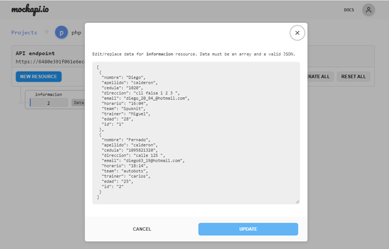
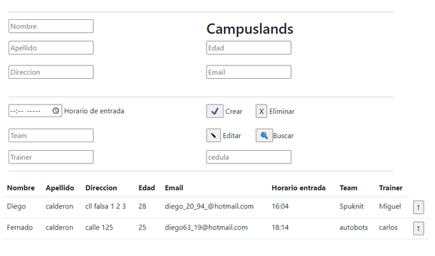
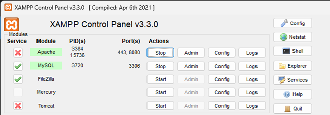

### ***INFORMACION DEL ARCHIVO ***

Este es un archivo PHP que contiene HTML en forma Frankenstein(mexclado) para manejar un formulario y realizar metodos de  (POST)crear, (GET)buscar, (PUT)editar y (DELETE)eliminar datos usando una API simulada MOCKapi.io ([link de la base de datos simulada](https://mockapi.io/projects/6480e391f061e6ec4d49fed9)) .

#### **El formulario incluye los siguientes campos:**

-Nombre
-Apellido
-direccion
-Edad
-Correo electrónico
-Horario de entrada
-Equipo
-Entrenador
-Cédula

#### Funcionalidades:

* ***Crear:***
  Al ingresar los datos seguido de orpimir el boton crear que contiene un "✔" se realiza una solicitud POST, se enviarán los datos a la base de datos simulada y posteriormente se verá reflejada la informacion en la tabla inferior, NOTA: si no ingresa una cedula, no se realizará el procedimiento de guardado de informacion.
* ***Buscar:***
  Al ingresar una cédula y hacer clic en el botón "Buscar" que contiene el logo: 🔍,  se realiza una solicitud GET  para que busque la información asociada a esa cédula y la envie a nuestro formulario situandola en cada input según corresponda. NOTA: si no ingresa un numero de cédula para la busqueda, no se podrá realizar el procedimiento por otra parte, si ingresa un numero no asociado a alguna cédula, saldrá un anuncio en la parte superior izquierda diciendo: No se encontraron resultados.

* ***Editar:***
  Después de buscar un registro por medio de la cédula, se pueden modificar los campos del formulario y hacer clic en el botón "Editar" que contiene el logo:✎. Se realizará la petición PUT y se modificará la informacion en la base de datos, si dejamos el campo de la cédula vacia y orpimimos el botón buscar, saldrá un letrero en la parte superior iquierda el cual nos infomará: No se encontrarón datos para la cedula ingresada.

* ** *Eliminar:***
  Después de buscar un registro, podremos eliminarlo de nuestra base de datos oprimiendo el botón Eliminar con el logo: X, esto realizará una peticion DELETE a nuestra base de datos y eliminará la informacion asociada a la cédula ingresada a continuación, saldrá un letrero que nos indica: los datos se eliminaron correctamente.

Visualizacion de datos:
Los datos obtenidos de la API se podrán visualizar en una tabla en la parte inferior, la cuál contiene todos los datos menos la cédula, tambien podemos identificar un boton al costado derecho de cada informacion.

Boton ↑:  Este botón tiene la funcionalidad de poder subir la informacion del usuario especifico, esta acción es realizada gracias al metodo GET, mediante la misma funcion de buscar que mensionamos anteriormente.

Requisitos y configuracion:
El archivo requiere un servidor web con soporte para PHP en este caso utilizamos el programa XAMPP el cuál mediante el modulo Apache nos ayuda para realizar las funciones necesarias para el manejo de base de datos, el archivo PHP utiliza una API simulada para realizar las operaciones CRUD.$urly se puede modificar según sea necesario.

**Espero que esta informacion sea util para comprender y utilizar la base de datos.**
